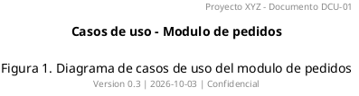

# Referencia PlantUML para diagramas de casos de uso

Sintaxis completa y patrones listos para copiar. Consultar cuando haga falta algo
mas alla del esqueleto basico del SKILL.md.

## Declaracion de elementos

```plantuml
' Actores: tres formas equivalentes
actor Cliente
actor "Gestor de pedidos" as ACT02
:Administrador: as ACT03

' Actor no humano (sistema externo)
actor "ERP Corporativo" as ACT04 <<sistema>>

' Casos de uso: dos formas equivalentes
usecase "UC-01\nRegistrar pedido" as UC01
(Consultar historico) as UC02

' Descripcion multilinea con separador
usecase UC03 as "UC-03 Pagar pedido
--
Incluye pago con tarjeta,
transferencia y monedero"
```

Preferir siempre la forma `usecase "..." as ALIAS`: los alias cortos sin guiones
mantienen las relaciones legibles y evitan errores de parseo.

## Frontera del sistema

```plantuml
rectangle "Tienda online" {
  usecase "UC-01\nRegistrar pedido" as UC01
}
```

Alternativa con paquetes cuando hay subsistemas dentro de la misma frontera:

```plantuml
rectangle "Plataforma logistica" {
  package "Almacen" {
    usecase "UC-10\nRecepcionar mercancia" as UC10
  }
  package "Expediciones" {
    usecase "UC-20\nPreparar envio" as UC20
  }
}
```

Los actores se declaran **fuera** del `rectangle`. Si aparecen dentro, PlantUML
los dibuja dentro de la frontera y el diagrama pasa a ser incorrecto.

## Relaciones

```plantuml
' Asociacion actor - caso de uso (el actor inicia)
ACT01 --> UC01

' Asociacion caso de uso - actor secundario (el sistema consulta al actor)
UC03 --> ACT04

' Asociacion sin direccion (valida, pero preferir la dirigida)
ACT01 -- UC01

' Include: el base apunta al incluido
UC01 ..> UC02 : <<include>>

' Extend: la extension apunta al base
UC04 ..> UC01 : <<extend>>

' Generalizacion entre casos de uso
UC05 --|> UC01

' Generalizacion entre actores (el hijo hereda los casos del padre)
ACT02 --|> ACT01
```

Etiqueta con condicion de extension:

```plantuml
UC04 ..> UC01 : <<extend>>\n[importe > 1000 EUR]
```

## Notas y puntos de extension

```plantuml
note right of UC01
  Punto de extension:
  validacion de credito
end note

note "RN-07: un pedido cancelado\nno se puede reactivar" as N1
N1 .. UC05
```

## Control del layout

```plantuml
left to right direction       ' recomendado para casos de uso
top to bottom direction       ' por defecto

' Forzar posicion relativa alargando la flecha
ACT01 -down-> UC01
ACT02 -up-> UC02

' Ocultar elementos sin borrarlos (util para vistas parciales)
hide ACT03

' Separadores visuales de agrupacion
together {
  usecase "UC-01" as UC01
  usecase "UC-02" as UC02
}
```

Si el diagrama sale desordenado, actuar en este orden: 1) cambiar la direccion,
2) agrupar con `together`, 3) alargar flechas concretas con `-down->`/`-up->`,
4) partir el diagrama en dos. No perseguir un layout perfecto: un diagrama que
necesita 20 ajustes de layout es un diagrama demasiado grande.

## Estereotipos y colores puntuales

```plantuml
usecase "UC-99\nIntegracion futura" as UC99 <<fuera-alcance>>
actor "Reloj" as ACT99 <<sistema>>
```

Los estereotipos `<<sistema>>` y `<<fuera-alcance>>` ya tienen estilo definido en
`assets/estilo.puml`. Para un color puntual:

```plantuml
usecase "UC-07" as UC07 #FFCDD2
ACT01 --> UC01 #red;line.bold : prioritario
```

## Diagrama de contexto (nivel 0)

Cuando hay muchos casos de uso, un primer diagrama solo con paquetes:

```plantuml
@startuml DCU-00-contexto
!include ../assets/estilo.puml
left to right direction
title Mapa de casos de uso - Contexto (v0.1)

actor "Cliente" as ACT01
actor "Gestor" as ACT02
actor "ERP" as ACT03 <<sistema>>

rectangle "Tienda online" {
  usecase "Gestion de pedidos\n(UC-01 a UC-08)"   as P1
  usecase "Gestion de catalogo\n(UC-10 a UC-15)"  as P2
  usecase "Facturacion\n(UC-20 a UC-24)"          as P3
}

ACT01 --> P1
ACT02 --> P2
ACT02 --> P3
P3 --> ACT03
@enduml
```

## Cabecera y pie para documentacion formal



## Errores de sintaxis frecuentes

| Sintoma | Causa | Solucion |
| --- | --- | --- |
| Imagen roja con texto de error | Sintaxis invalida | Leer el mensaje: indica la linea |
| Los actores salen dentro de la caja | Declarados dentro del `rectangle` | Moverlos antes del bloque |
| El alias no se reconoce | Alias con guion, espacio o acento | Usar `UC01`, no `UC-01` ni `UC 01` |
| Acentos rotos | Fichero no UTF-8 | Guardar en UTF-8; el script ya pasa `-charset UTF-8` |
| `!include` no encontrado | Ruta relativa al fichero, no al cwd | Comprobar la ruta desde la carpeta del `.puml` |
| Diagrama vacio | Falta `@startuml` / `@enduml` | Anadirlos |

## Renderizado

```bash
# Un fichero, ambos formatos
bash "${CLAUDE_PLUGIN_ROOT}/scripts/render-uml.sh" diagramas/DCU-01.puml -f both

# Toda la carpeta a SVG, en un directorio de salida concreto
bash "${CLAUDE_PLUGIN_ROOT}/scripts/render-uml.sh" diagramas/ -f svg -o entregables/img
```

SVG para documentacion web y wiki (escala sin perder calidad, el texto es
seleccionable y buscable). PNG para Word, PowerPoint y correo.
